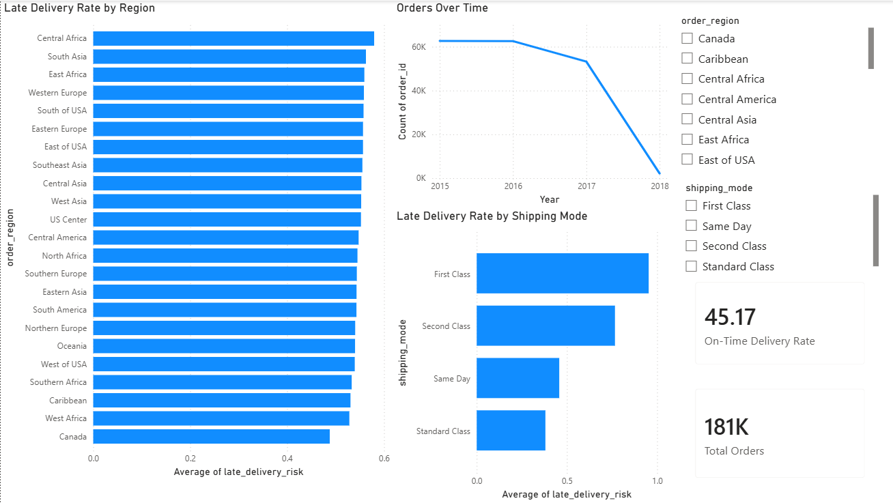

# Supply Chain ETL Pipeline

An end-to-end ETL pipeline for supply chain analytics. Built around the DataCo Smart Supply Chain dataset, this project ingests raw order and shipment data, transforms it into a clean analytical schema, loads it into a SQLite database, and serves it to a Power BI dashboard for delivery performance analysis.

This is a project that I am developing in versions, v1 ships a working local pipeline, and each subsequent version adds a layer of production-grade infrastructure (cloud storage, orchestration, data quality, deployment).

## Current status: v1 (shipped)

End-to-end pipeline running locally on a single CSV. Manual runs.

- [x] Extract: load DataCo CSV with proper encoding handling
- [x] Transform: drop useless/PII columns, parse dates, normalize column names
- [x] Load: write cleaned data to SQLite
- [x] Dashboard: Power BI connected to SQLite

## Dashboard preview



## Roadmap

This is v1. The plan continues through v2 (Postgres + S3 + tests), v3 (Airflow + star schema + weather API), and v4 (incremental loads + monitoring + deployment).

## Tech stack

- Python 3.14
- pandas
- sqlite3
- Power BI Desktop
- Kaggle API (for dataset ingestion)

## Data source

[DataCo Smart Supply Chain](https://www.kaggle.com/datasets/shashwatwork/dataco-smart-supply-chain-for-big-data-analysis) — ~180K supply chain transactions with order, shipment, delivery, customer, and product information.

The CSV is not committed to this repo. You'll need a Kaggle account and API token to download it (see "How to run it" below).

## How to run it

### Prerequisites

- Python 3.14
- A Kaggle account with an API token configured at `~/.kaggle/access_token`
- Power BI Desktop (to view the dashboard)

### Steps

```bash
# Clone the repo
git clone https://github.com/U-Ekene/supply-chain-etl-pipeline-project.git
cd supply-chain-etl-pipeline-project

# Set up the environment
python -m venv .venv
source .venv/Scripts/activate    # Windows Git Bash
# OR: source .venv/bin/activate   # Mac/Linux
pip install -r requirements.txt

# Download the dataset from Kaggle
kaggle datasets download -d shashwatwork/dataco-smart-supply-chain-for-big-data-analysis -p data/raw/ --unzip

# Run the full pipeline
python -m src.pipeline
```

After the pipeline runs, the SQLite database is created at `db/supply_chain.db` with a single `orders` table containing the cleaned data.

### View the dashboard

Open `dashboards/supply_chain_v1.pbix` in Power BI Desktop. The dashboard connects to a local SQLite database via ODBC.

## Project structure

```
supply-chain-etl-pipeline-project/
├── src/
│   ├── extract.py       # Read CSV from disk
│   ├── transform.py     # Clean and reshape data
│   ├── load.py          # Write to SQLite
│   └── pipeline.py      # Orchestrate extract → transform → load
├── sql/                 # Schema definitions (v2+)
├── notebooks/
│   └── 01_exploration.ipynb    # Initial data profiling
├── dashboards/
│   └── supply_chain_v1.pbix    # Power BI dashboard
├── data/                # Raw and processed data (gitignored)
├── db/                  # SQLite database (gitignored)
├── docs/                # Architecture and screenshots
└── tests/               # Test suite (added in v2)
```

## Architecture

For v1 the flow is:

`DataCo CSV → Python ETL (pandas) → SQLite → Power BI dashboard`

## What I found in the data

A few observations from profiling and analysis:

- **55% of orders were marked as late deliveries** - a striking baseline that drives the dashboard's central question
- **First Class shipping has a ~95% late rate**, much worse than Same Day or Standard Class. The fastest-marketed shipping mode is consistently the most delayed in this dataset.
- **Late delivery rate is fairly uniform across regions** (between 49% and 58%) - geography matters less than shipping mode for predicting lateness
- **Orders show an apparent drop in 2018**, but this reflects incomplete data as the dataset ends partway through 2018
- The raw CSV contained PII (customer emails, passwords, names, addresses) that I dropped in the transform stage, plus two columns that were essentially empty (Product Description at 100% null, Order Zipcode at 86% null)

## Notes / things I learned

- DataCo's CSV is Latin-1 encoded, not UTF-8. First attempt to load with pandas crashed until I specified the encoding.
- The `late_delivery_risk` column is binary (0/1), making it possible to compute the late rate by simply averaging it.
